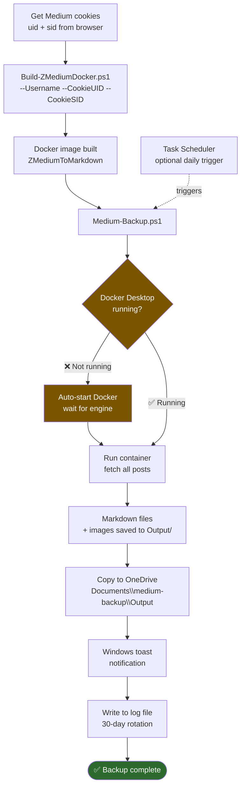

# Windows Medium Backup

<!-- BADGES:START -->
[](LICENSE) [](https://learn.microsoft.com/en-us/powershell/) [](https://www.docker.com/) [](https://www.microsoft.com/windows) [](https://github.com/5a9awneh/windows-medium-backup/commits/main) [](https://github.com/5a9awneh/windows-medium-backup) [](https://github.com/5a9awneh/windows-medium-backup) [](https://github.com/5a9awneh/windows-medium-backup)
<!-- BADGES:END -->

Automated Medium post backup to Markdown for Windows using Docker Desktop (Hyper-V), powered by [ZMediumToMarkdown](https://github.com/ZhgChgLi/ZMediumToMarkdown).

## 🗺️ How It Works



## ❓ Why?

- ✅ No WSL2 required (pure Hyper-V)
- ✅ Works with OneDrive
- ✅ Handles paywall posts (with cookies)
- ✅ Modern Windows notifications
- ✅ Task Scheduler automation ready

## 🚀 Quick Start

### Prerequisites
- Windows 10/11 Pro/Enterprise/Education
- Docker Desktop installed
- Hyper-V enabled
- PowerShell 5.1+

### Installation

**1. Get Medium Cookies:**
- Open Medium.com in browser (logged in)
- Press F12 → Application → Cookies → medium.com
- Copy `uid` value
- Copy `sid` value

**2. Build Docker Image:**
```powershell
.\Build-ZMediumDocker.ps1 -Username "yourname" -CookieUID "abc123" -CookieSID "def456"
```

**3. Run Backup:**
```powershell
.\Medium-Backup.ps1 -Verbose
```

**Sample run:**

```
VERBOSE: Checking Docker Desktop status...
VERBOSE: Docker Desktop is running.
VERBOSE: Output location: C:\Users\yourname\windows-medium-backup\Output
VERBOSE: Starting ZMediumToMarkdown container for user: yourname
VERBOSE: Downloading posts...

  [1/12] the-hidden-registry-key-that-blocks-windows-hello.md  ✓
  [2/12] automating-medium-backup-on-windows.md                ✓
  [3/12] why-your-printer-address-book-wont-import.md          ✓
  ...
  [12/12] getting-started-with-pester-5.md                     ✓

VERBOSE: Restructuring 12 articles into per-article folders...
VERBOSE: Writing log: Medium-Backup-20260506.log
VERBOSE: Sending toast notification...

✅ Backup completed successfully!
📁 Location: C:\Users\yourname\windows-medium-backup\Output
📊 Articles: 12 (each in its own folder)
📝 Log: Medium-Backup-20260506.log
```

Done! Posts saved to `Output\` next to the script.

## 📚 Documentation

- [**SETUP.md**](SETUP.md) - Detailed setup instructions
- [**TROUBLESHOOTING.md**](TROUBLESHOOTING.md) - Common issues and solutions
- [**TASK-SCHEDULER.md**](TASK-SCHEDULER.md) - Automated daily backups via `Register-Task.ps1`

## 📁 Output Structure

```
Output\
├── 2024-07-10-remove-sensitive-data-1ad65c2593f7\
│   ├── 2024-07-10-remove-sensitive-data-1ad65c2593f7.md
│   └── assets\
│       └── image.png
└── 2025-12-20-google-ai-product-chaos-e35dc04a7a4d\
    ├── 2025-12-20-google-ai-product-chaos-e35dc04a7a4d.md
    └── assets\
        └── image.jpg
```

Each article gets its own folder. Assets are co-located and image paths in the Markdown are rewritten automatically.

## ✨ Features

- **Automatic Docker management** - Starts Docker if not running
- **OneDrive compatible** - Handles OneDrive paths automatically
- **Toast notifications** - Visual feedback when backup completes
- **Automatic logging** - 30-day log rotation
- **Error recovery** - Detailed error messages and troubleshooting

## 📋 Requirements

### Windows Edition
- Windows 10/11 Pro, Enterprise, or Education
- Home editions: Hyper-V not available (WSL2 support planned)

### Software
- Docker Desktop 4.0+ with Hyper-V backend
- PowerShell 5.1+ (included in Windows)

## 🍪 Cookie Expiration

Medium cookies expire after 30-90 days. When backup fails with authentication error:
1. Get fresh cookies (see above)
2. Rebuild Docker image with new cookies
3. Run backup again

See [TROUBLESHOOTING.md](TROUBLESHOOTING.md) for details.

## 🙏 Credits

- [**ZMediumToMarkdown**](https://github.com/ZhgChgLi/ZMediumToMarkdown) by ZhgChgLi - Core conversion tool
- [**BurntToast**](https://github.com/Windos/BurntToast) by Windos - Windows 10 toast notifications

## 📄 License

MIT License - See [LICENSE](LICENSE) file for details

## 🤝 Contributing

This is a simple utility project. Issues and pull requests welcome, but keeping scope minimal.
